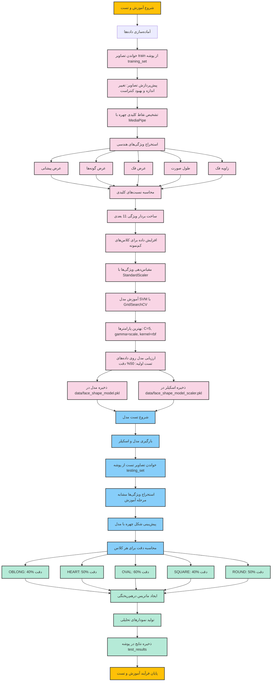

```mermaid
flowchart TD
    A[شروع آموزش و تست] --> B[آماده‌سازی داده‌ها]
    
    %% مرحله آموزش
    B --> C[خواندن تصاویر train از پوشه training_set]
    C --> D[پیش‌پردازش تصاویر: تغییر اندازه و بهبود کنتراست]
    D --> E[تشخیص نقاط کلیدی چهره با MediaPipe]
    E --> F[استخراج ویژگی‌های هندسی]
    F --> G1[عرض پیشانی]
    F --> G2[عرض گونه‌ها]
    F --> G3[عرض فک]
    F --> G4[طول صورت]
    F --> G5[زاویه فک]
    
    G1 --> H1[محاسبه نسبت‌های کلیدی]
    G2 --> H1
    G3 --> H1
    G4 --> H1
    G5 --> H1
    
    H1 --> I[ساخت بردار ویژگی 11 بعدی]
    I --> J[افزایش داده برای کلاس‌های کم‌نمونه]
    J --> K[مقیاس‌دهی ویژگی‌ها با StandardScaler]
    K --> L[آموزش مدل SVM با GridSearchCV]
    L --> M[بهترین پارامترها: C=5, gamma=scale, kernel=rbf]
    M --> N[ارزیابی مدل روی داده‌های تست اولیه: 50% دقت]
    N --> O[ذخیره مدل در data/face_shape_model.pkl]
    N --> P[ذخیره اسکیلر در data/face_shape_model_scaler.pkl]
    
    %% مرحله تست
    O --> Q[شروع تست مدل]
    P --> Q
    Q --> R[بارگیری مدل و اسکیلر]
    R --> S[خواندن تصاویر تست از پوشه testing_set]
    S --> T[استخراج ویژگی‌ها مشابه مرحله آموزش]
    T --> U[پیش‌بینی شکل چهره با مدل]
    U --> V[محاسبه دقت برای هر کلاس]
    V --> W[OBLONG: 40% دقت]
    V --> X[HEART: 50% دقت]
    V --> Y[OVAL: 60% دقت]
    V --> Z[SQUARE: 40% دقت]
    V --> AA[ROUND: 50% دقت]
    
    W --> AB[ایجاد ماتریس درهم‌ریختگی]
    X --> AB
    Y --> AB
    Z --> AB
    AA --> AB
    
    AB --> AC[تولید نمودارهای تحلیلی]
    AC --> AD[ذخیره نتایج در پوشه test_results]
    AD --> AE[پایان فرآیند آموزش و تست]
    
    %% استایل‌دهی
    classDef trainStep fill:#f9d5e5,stroke:#333,stroke-width:2px
    classDef testStep fill:#87CEFA,stroke:#333,stroke-width:2px
    classDef resultStep fill:#b5ead7,stroke:#333,stroke-width:2px
    
    class C,D,E,F,G1,G2,G3,G4,G5,H1,I,J,K,L,M,N,O,P trainStep
    class Q,R,S,T,U,V testStep
    class W,X,Y,Z,AA,AB,AC,AD resultStep
    
    style A fill:#FFC107,stroke:#333,stroke-width:2px
    style AE fill:#FFC107,stroke:#333,stroke-width:2px
```