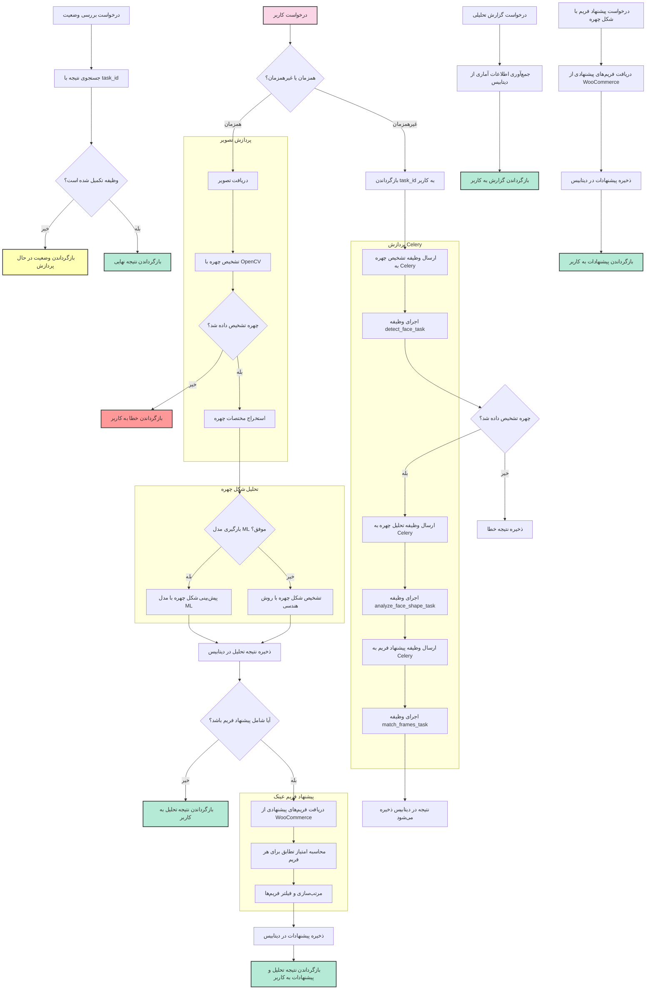

# فرآیند کامل سیستم تشخیص چهره و پیشنهاد فریم عینک

این مستند، فرآیند کامل سیستم تشخیص چهره و پیشنهاد فریم عینک را شرح می‌دهد. این سیستم قادر است تصویر چهره کاربر را پردازش کرده، شکل چهره را تشخیص دهد و فریم‌های عینک مناسب را پیشنهاد دهد.

## فهرست مطالب
1. [خلاصه سیستم](#1-خلاصه-سیستم)
2. [فرآیندهای اصلی](#2-فرآیندهای-اصلی)
3. [جریان کار سیستم](#3-جریان-کار-سیستم)
4. [توضیحات مراحل مختلف](#4-توضیحات-مراحل-مختلف)
5. [تفاوت پردازش همزمان و غیرهمزمان](#5-تفاوت-پردازش-همزمان-و-غیرهمزمان)

## 1. خلاصه سیستم

سیستم تشخیص چهره و پیشنهاد فریم عینک یک راه‌حل کامل برای فروشگاه‌های آنلاین عینک است که به مشتریان کمک می‌کند فریم‌های متناسب با شکل چهره خود را انتخاب کنند. این سیستم قادر است:

- چهره را در تصویر شناسایی کند
- شکل چهره را تشخیص دهد (بیضی، گرد، مربعی، قلبی، کشیده)
- فریم‌های مناسب برای هر شکل چهره را پیشنهاد دهد
- نتایج را در دیتابیس ذخیره کند
- گزارش‌های تحلیلی ارائه دهد

سیستم می‌تواند به دو روش همزمان (Synchronous) یا غیرهمزمان (Asynchronous) کار کند.

## 2. فرآیندهای اصلی

سیستم از چهار فرآیند اصلی تشکیل شده است:

1. **پردازش تصویر**:
   - دریافت تصویر از کاربر
   - تشخیص چهره در تصویر با OpenCV
   - استخراج مختصات و ویژگی‌های چهره

2. **تحلیل شکل چهره**:
   - استفاده از مدل ML آموزش‌دیده (SVM) برای پیش‌بینی شکل چهره
   - در صورت عدم موفقیت، استفاده از روش هندسی و قانون‌محور
   - محاسبه میزان اطمینان تشخیص

3. **پیشنهاد فریم عینک**:
   - دریافت فریم‌های مناسب از WooCommerce
   - محاسبه امتیاز تطابق برای هر فریم
   - مرتب‌سازی و فیلتر کردن نتایج

4. **پردازش غیرهمزمان با Celery**:
   - اجرای وظایف به صورت غیرهمزمان
   - امکان پیگیری وضعیت پردازش
   - افزایش مقیاس‌پذیری سیستم

## 3. جریان کار سیستم

نمودار زیر جریان کامل کار سیستم را نشان می‌دهد:

## 4. توضیحات مراحل مختلف

### 4.1. پردازش همزمان (Synchronous)

1. **دریافت تصویر** (C): 
   - تصویر چهره از کاربر دریافت می‌شود
   - اعتبارسنجی فرمت و محتوای تصویر انجام می‌شود

2. **تشخیص چهره با OpenCV** (D):
   - از OpenCV با الگوریتم Haar Cascade یا MediaPipe استفاده می‌شود
   - برای تشخیص دقیق‌تر، از ترکیب چند روش استفاده می‌شود

3. **بررسی نتیجه تشخیص** (E):
   - اگر چهره تشخیص داده نشود، خطا به کاربر برگردانده می‌شود
   - در صورت موفقیت، مختصات چهره استخراج می‌شود

4. **استخراج مختصات چهره** (G):
   - استخراج موقعیت، اندازه و نسبت‌های مهم چهره
   - آماده‌سازی داده‌ها برای مرحله تحلیل

5. **بارگیری مدل ML** (H):
   - تلاش برای بارگیری مدل آموزش دیده SVM
   - در صورت موفقیت، از مدل برای پیش‌بینی استفاده می‌شود
   - در غیر این صورت، از روش هندسی استفاده می‌شود

6. **تشخیص شکل چهره** (I1/I2):
   - استخراج ویژگی‌های هندسی چهره
   - محاسبه نسبت‌های مهم (عرض به طول، گونه به فک، و غیره)
   - تعیین شکل چهره (بیضی، گرد، مربعی، قلبی، کشیده)

7. **ذخیره نتیجه تحلیل** (J):
   - ذخیره شکل چهره، میزان اطمینان و اطلاعات مرتبط در دیتابیس

8. **بررسی نیاز به پیشنهاد فریم** (K):
   - اگر کاربر فقط نیاز به تشخیص شکل چهره داشته باشد، نتیجه برگردانده می‌شود
   - در غیر این صورت، مرحله پیشنهاد فریم آغاز می‌شود

9. **پیشنهاد فریم** (M-O):
   - دریافت محصولات از WooCommerce
   - فیلتر کردن فریم‌های مناسب براساس شکل چهره
   - محاسبه امتیاز تطابق برای هر فریم
   - مرتب‌سازی نتایج براساس امتیاز تطابق

10. **ذخیره و بازگرداندن نتایج** (P-L2):
    - ذخیره پیشنهادات در دیتابیس
    - بازگرداندن نتیجه کامل به کاربر

### 4.2. پردازش غیرهمزمان (Asynchronous)

1. **بازگرداندن task_id** (Q):
   - یک شناسه وظیفه (task_id) تولید و به کاربر بازگردانده می‌شود
   - کاربر می‌تواند با این شناسه، وضعیت پردازش را پیگیری کند

2. **تشخیص چهره با Celery** (R-S):
   - وظیفه تشخیص چهره به صف Celery ارسال می‌شود
   - کارگر Celery وظیفه را اجرا می‌کند

3. **زنجیره وظایف** (V-Y):
   - پس از تشخیص چهره، وظیفه تحلیل شکل چهره آغاز می‌شود
   - پس از تحلیل شکل چهره، وظیفه پیشنهاد فریم آغاز می‌شود
   - هر مرحله نتایج خود را در دیتابیس ذخیره می‌کند

4. **بررسی وضعیت پردازش** (AA-AE):
   - کاربر می‌تواند با استفاده از task_id، وضعیت پردازش را بررسی کند
   - در صورت تکمیل وظیفه، نتیجه نهایی به کاربر بازگردانده می‌شود
   - در غیر این صورت، وضعیت در حال پردازش به کاربر اعلام می‌شود

### 4.3. پیشنهاد فریم مستقیم

1. **درخواست مستقیم پیشنهاد فریم** (AF):
   - کاربر می‌تواند بدون ارسال تصویر، مستقیماً شکل چهره خود را وارد کند
   - این حالت برای کاربرانی مفید است که از قبل شکل چهره خود را می‌دانند

2. **دریافت و ارائه پیشنهادات** (AG-AI):
   - فریم‌های مناسب برای شکل چهره مورد نظر دریافت می‌شوند
   - نتایج در دیتابیس ذخیره شده و به کاربر بازگردانده می‌شوند

### 4.4. گزارش‌های تحلیلی

1. **درخواست گزارش تحلیلی** (AJ):
   - مدیران سیستم می‌توانند گزارش‌های تحلیلی درخواست کنند

2. **تولید و ارائه گزارش** (AK-AL):
   - داده‌های آماری از دیتابیس جمع‌آوری می‌شوند
   - گزارش‌های تحلیلی تولید و ارائه می‌شوند

## 5. تفاوت پردازش همزمان و غیرهمزمان

### 5.1. پردازش همزمان (Synchronous)
- **مزایا**:
  - پاسخ سریع به کاربر
  - فرآیند ساده‌تر
  - نیاز به نگهداری حالت کمتر

- **معایب**:
  - محدودیت در تعداد درخواست‌های همزمان
  - احتمال timeout در صورت طولانی شدن پردازش
  - فشار بیشتر بر سرور اصلی

- **مناسب برای**:
  - تعداد کاربران کم
  - تصاویر با کیفیت متوسط
  - زمانی که سرعت پاسخ مهم است

### 5.2. پردازش غیرهمزمان (Asynchronous)
- **مزایا**:
  - مقیاس‌پذیری بالا
  - توزیع بار بین چندین کارگر
  - قابلیت اطمینان بیشتر

- **معایب**:
  - پیچیدگی بیشتر سیستم
  - نیاز به پیگیری وضعیت
  - تأخیر در دریافت نتیجه نهایی

- **مناسب برای**:
  - تعداد کاربران زیاد
  - تصاویر با کیفیت بالا
  - فرآیندهای پردازشی سنگین

### 5.3. معیارهای انتخاب روش پردازش
- **حجم ترافیک سایت**: برای سایت‌های پربازدید، پردازش غیرهمزمان مناسب‌تر است
- **زمان پردازش**: برای پردازش‌های زمان‌بر، روش غیرهمزمان توصیه می‌شود
- **تجربه کاربری**: اگر سرعت پاسخ مهم است، روش همزمان با بهینه‌سازی پردازش مناسب‌تر است
- **منابع سرور**: با محدودیت منابع، پردازش غیرهمزمان باعث توزیع بهتر بار می‌شود