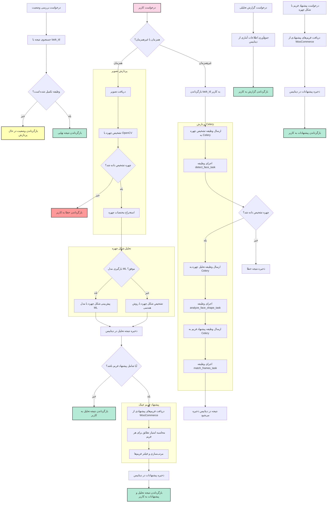

```mermaid
flowchart TD
    A[درخواست کاربر] --> B{همزمان یا غیرهمزمان؟}
    
    %% پردازش همزمان
    B -->|همزمان| C[دریافت تصویر]
    C --> D[تشخیص چهره با OpenCV]
    D --> E{چهره تشخیص داده شد؟}
    E -->|خیر| F[بازگرداندن خطا به کاربر]
    E -->|بله| G[استخراج مختصات چهره]
    
    %% پردازش تحلیل چهره
    G --> H{بارگیری مدل ML موفق؟}
    H -->|بله| I1[پیش‌بینی شکل چهره با مدل ML]
    H -->|خیر| I2[تشخیص شکل چهره با روش هندسی]
    I1 --> J[ذخیره نتیجه تحلیل در دیتابیس]
    I2 --> J
    
    %% پیشنهاد فریم
    J --> K{آیا شامل پیشنهاد فریم باشد؟}
    K -->|خیر| L1[بازگرداندن نتیجه تحلیل به کاربر]
    K -->|بله| M[دریافت فریم‌های پیشنهادی از WooCommerce]
    M --> N[محاسبه امتیاز تطابق برای هر فریم]
    N --> O[مرتب‌سازی و فیلتر فریم‌ها]
    O --> P[ذخیره پیشنهادات در دیتابیس]
    P --> L2[بازگرداندن نتیجه تحلیل و پیشنهادات به کاربر]
    
    %% پردازش غیرهمزمان با Celery
    B -->|غیرهمزمان| Q[بازگرداندن task_id به کاربر]
    Q --> R[ارسال وظیفه تشخیص چهره به Celery]
    R --> S[اجرای وظیفه detect_face_task]
    S --> T{چهره تشخیص داده شد؟}
    T -->|خیر| U[ذخیره نتیجه خطا]
    T -->|بله| V[ارسال وظیفه تحلیل چهره به Celery]
    V --> W[اجرای وظیفه analyze_face_shape_task]
    W --> X[ارسال وظیفه پیشنهاد فریم به Celery]
    X --> Y[اجرای وظیفه match_frames_task]
    Y --> Z[نتیجه در دیتابیس ذخیره می‌شود]
    
    %% درخواست بررسی وضعیت وظیفه
    AA[درخواست بررسی وضعیت] --> AB[جستجوی نتیجه با task_id]
    AB --> AC{وظیفه تکمیل شده است؟}
    AC -->|خیر| AD[بازگرداندن وضعیت در حال پردازش]
    AC -->|بله| AE[بازگرداندن نتیجه نهایی]
    
    %% پیشنهاد فریم مستقیم
    AF[درخواست پیشنهاد فریم با شکل چهره] --> AG[دریافت فریم‌های پیشنهادی از WooCommerce]
    AG --> AH[ذخیره پیشنهادات در دیتابیس]
    AH --> AI[بازگرداندن پیشنهادات به کاربر]
    
    %% گزارش تحلیلی
    AJ[درخواست گزارش تحلیلی] --> AK[جمع‌آوری اطلاعات آماری از دیتابیس]
    AK --> AL[بازگرداندن گزارش به کاربر]

    %% اضافه کردن توضیحات
    subgraph "پردازش تصویر"
        C
        D
        E
        G
    end
    
    subgraph "تحلیل شکل چهره"
        H
        I1
        I2
    end
    
    subgraph "پیشنهاد فریم عینک"
        M
        N
        O
    end
    
    subgraph "پردازش Celery"
        R
        S
        V
        W
        X
        Y
    end

    style A fill:#f9d5e5,stroke:#333,stroke-width:2px
    style L1 fill:#b5ead7,stroke:#333,stroke-width:2px
    style L2 fill:#b5ead7,stroke:#333,stroke-width:2px
    style F fill:#ff9999,stroke:#333,stroke-width:2px
    style AD fill:#ffffb5,stroke:#333,stroke-width:2px
    style AE fill:#b5ead7,stroke:#333,stroke-width:2px
    style AI fill:#b5ead7,stroke:#333,stroke-width:2px
    style AL fill:#b5ead7,stroke:#333,stroke-width:2px
```