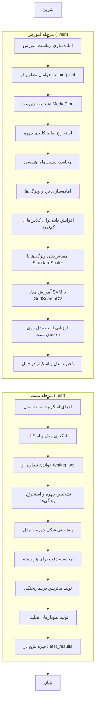

# راهنمای آموزش و تست مدل تشخیص شکل چهره

این راهنما مراحل آموزش و تست مدل تشخیص شکل چهره را برای پروژه پیشنهاد فریم عینک شرح می‌دهد.

## فهرست مطالب
1. [پکیج‌های مورد نیاز](#1-پکیجهای-مورد-نیاز)
2. [فرآیند آموزش مدل (Train)](#2-فرآیند-آموزش-مدل-train)
3. [فرآیند تست مدل (Test)](#3-فرآیند-تست-مدل-test)
4. [نتایج](#4-نتایج)
5. [نمودار فرآیند](#5-نمودار-فرآیند)

## 1. پکیج‌های مورد نیاز

برای اجرای فرآیند آموزش و تست مدل، پکیج‌های زیر نیاز است:

```
opencv-python==4.9.0.80
numpy==1.26.3
scikit-learn==1.4.0
mediapipe==0.10.18
pandas==2.2.0
seaborn==0.13.2
tqdm==4.66.1
matplotlib
joblib
```

## 2. فرآیند آموزش مدل (Train)

اسکریپت `train_face_shape_model.py` برای آموزش مدل استفاده می‌شود:

### 2.1. آماده‌سازی دیتاست

1. **ساختار داده‌ها:**
   - تصاویر آموزشی در پوشه `training_set` قرار دارند
   - برای هر شکل چهره (HEART, OBLONG, OVAL, ROUND, SQUARE) یک زیرپوشه وجود دارد
   - مسیر دیتاست: `./training_set/{shape_name}`

2. **پیش‌پردازش:**
   - خواندن تصاویر با OpenCV
   - تغییر اندازه تصاویر برای یکسان‌سازی (حداکثر ابعاد 800 پیکسل)
   - بهبود کنتراست با CLAHE
   - کاهش نویز با GaussianBlur

3. **افزایش داده (Augmentation):**
   - برای کلاس‌های Heart, Oval, Round که نمونه کمتری دارند
   - ایجاد تصاویر چرخش‌یافته (±5 درجه)
   - تغییر مقیاس تصاویر (110%)
   - تغییر کنتراست و روشنایی
   - معکوس‌کردن افقی تصاویر (flip)

### 2.2. استخراج ویژگی‌ها

با استفاده از MediaPipe Face Mesh، ویژگی‌های زیر از هر تصویر استخراج می‌شوند:

1. **نقاط کلیدی چهره:**
   - 468 نقطه از چهره با MediaPipe شناسایی می‌شود
   - نقاط کلیدی ضروری انتخاب می‌شوند (پیشانی، گونه‌ها، فک، چانه)

2. **ویژگی‌های اصلی:**
   - نسبت عرض به طول چهره (width_to_length_ratio)
   - نسبت گونه به فک (cheekbone_to_jaw_ratio)
   - نسبت پیشانی به گونه (forehead_to_cheekbone_ratio)
   - زاویه فک (normalized_jaw_angle)
   - نسبت شکل چهره (face_shape_ratio)
   - نسبت باریک‌شدگی (face_taper_ratio)

3. **ویژگی‌های تکمیلی:**
   - نسبت طول به عرض چهره (face_height_to_width_ratio)
   - نسبت فک به پیشانی (jaw_to_forehead_ratio)
   - برجستگی چانه (chin_prominence)
   - فاصله چشم‌ها به عرض چهره (eye_distance)
   - نسبت عرض پایین صورت به بالای صورت (bottom_to_top_width_ratio)

### 2.3. آموزش مدل

1. **آماده‌سازی داده‌ها:**
   - تقسیم داده‌ها به آموزش (training_set) و آزمون (testing_set)
   - مقیاس‌دهی ویژگی‌ها با StandardScaler

2. **مدل SVM:**
   - استفاده از ماشین بردار پشتیبان (SVM) با کرنل RBF
   - پارامترها: `C=5, gamma='scale', class_weight=None, kernel='rbf'`
   - استفاده از GridSearchCV برای یافتن بهترین پارامترها
   - اعتبارسنجی 5-fold

3. **ذخیره مدل:**
   - ذخیره مدل نهایی در `./data/face_shape_model.pkl`
   - ذخیره اسکیلر در `./data/face_shape_model_scaler.pkl`
   - خروجی لاگ: `مدل و اسکیلر با موفقیت در مسیر ./data ذخیره شدند`

### 2.4. نتایج آموزش

نتایج آموزش مدل روی داده‌های تست به شرح زیر است:

```
دقت روی مجموعه تست: 0.5000

گزارش طبقه‌بندی:
              precision    recall  f1-score   support

       HEART       0.44      0.48      0.46       200
      OBLONG       0.75      0.71      0.73       200
        OVAL       0.41      0.47      0.44       200
       ROUND       0.46      0.44      0.45       200
      SQUARE       0.47      0.40      0.43       200

    accuracy                           0.50      1000
   macro avg       0.50      0.50      0.50      1000
weighted avg       0.50      0.50      0.50      1000
```

## 3. فرآیند تست مدل (Test)

اسکریپت `test_face_shape_model.py` برای تست مدل استفاده می‌شود:

### 3.1. آماده‌سازی تست

1. **بارگیری مدل و اسکیلر:**
   - بارگیری مدل از `./data/face_shape_model.pkl`
   - بارگیری اسکیلر از `./data/face_shape_model_scaler.pkl`

2. **پوشه داده‌های تست:**
   - تصاویر تست در پوشه `testing_set` قرار دارند
   - ساختار مشابه پوشه آموزش

### 3.2. روند تست

1. **پردازش تک تصویر:**
   - خواندن تصویر تست
   - تشخیص چهره با MediaPipe
   - استخراج ویژگی‌ها
   - مقیاس‌دهی ویژگی‌ها با اسکیلر
   - پیش‌بینی شکل چهره با مدل

2. **تست دسته‌ای:**
   - انتخاب نمونه‌های تصادفی از هر دسته
   - پیش‌بینی و محاسبه دقت برای هر دسته
   - ایجاد ماتریس درهم‌ریختگی (confusion matrix)
   - تولید نمودارهای تحلیلی

3. **ذخیره نتایج:**
   - ذخیره نتایج تست در پوشه `test_results`
   - ذخیره ماتریس درهم‌ریختگی به صورت تصویر
   - ذخیره نمودار دقت برای هر شکل چهره

### 3.3. نتایج تست

نتایج تست مدل روی داده‌های مستقل:

```
===== نتایج نهایی =====
OBLONG (کشیده): 40.00% دقت
HEART (قلبی): 50.00% دقت
OVAL (بیضی): 60.00% دقت
SQUARE (مربعی): 40.00% دقت
ROUND (گرد): 50.00% دقت
```

## 4. نتایج

### 4.1. نتایج آموزش
- **تعداد کل داده‌های آموزش:** 4358
- **تعداد کل داده‌های تست:** 1000
- **بهترین پارامترها:** `{'C': 5, 'class_weight': None, 'gamma': 'scale', 'kernel': 'rbf'}`
- **دقت کلی:** 50.00%
- **بهترین عملکرد:** OBLONG (73% F1-score)
- **ضعیف‌ترین عملکرد:** SQUARE (43% F1-score)

### 4.2. نتایج تست
- **دقت متوسط:** 48.00%
- **بهترین عملکرد:** OVAL با 60.00% دقت
- **ضعیف‌ترین عملکرد:** OBLONG و SQUARE با 40.00% دقت

### 4.3. مقایسه عملکرد
- مدل روی شکل چهره OVAL بهترین عملکرد را در تست مستقل دارد
- شکل OBLONG در داده‌های آموزش خوب عمل کرده اما در تست مستقل ضعیف است
- تفاوت‌های عملکردی می‌تواند به دلیل تفاوت در کیفیت و زاویه تصاویر تست باشد

## 5. نمودار فرآیند

نمودار مراحل آموزش و تست مدل:



### توضیحات نمودار:
1. **مرحله آماده‌سازی:** تصاویر خوانده شده و نقاط کلیدی چهره استخراج می‌شوند
2. **مرحله استخراج ویژگی:** نسبت‌های هندسی چهره محاسبه و بردار ویژگی تشکیل می‌شود
3. **مرحله آموزش:** مدل SVM با پارامترهای بهینه آموزش می‌بیند
4. **مرحله تست:** مدل روی تصاویر جدید تست می‌شود و نتایج تحلیل می‌شوند

## نکات کلیدی
- استفاده از MediaPipe Face Mesh برای استخراج نقاط کلیدی چهره
- تمرکز روی 5 شکل چهره: HEART, OBLONG, OVAL, ROUND, SQUARE
- استفاده از ترکیب 11 ویژگی هندسی برای تشخیص شکل چهره
- دقت کلی 50% نشان می‌دهد که مدل می‌تواند از تشخیص تصادفی بهتر عمل کند
- پیشنهاد می‌شود از روش‌های ترکیبی (هندسی + ML) برای افزایش دقت استفاده شود